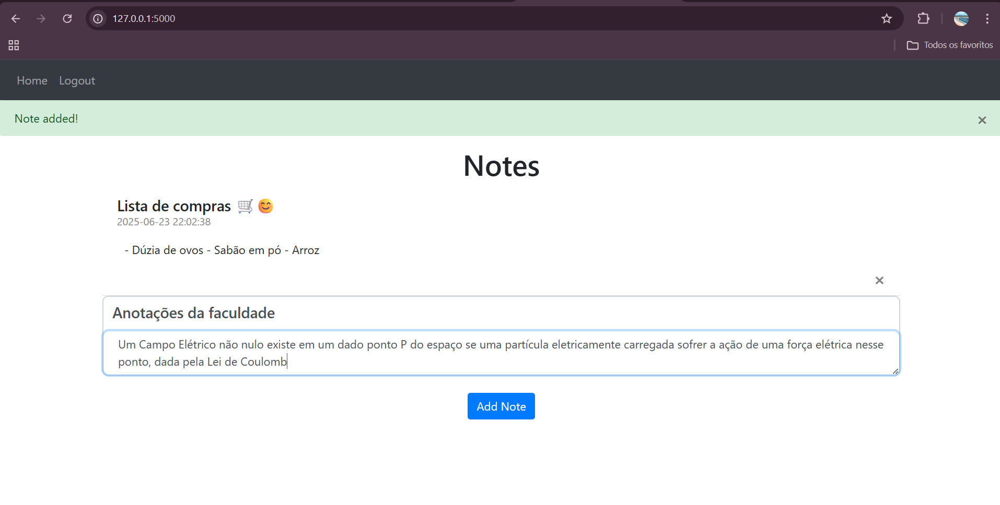
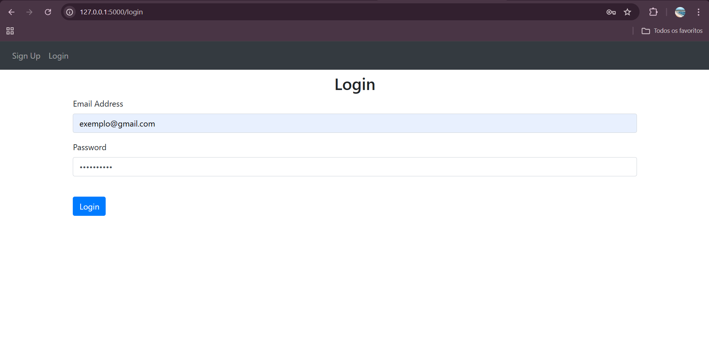
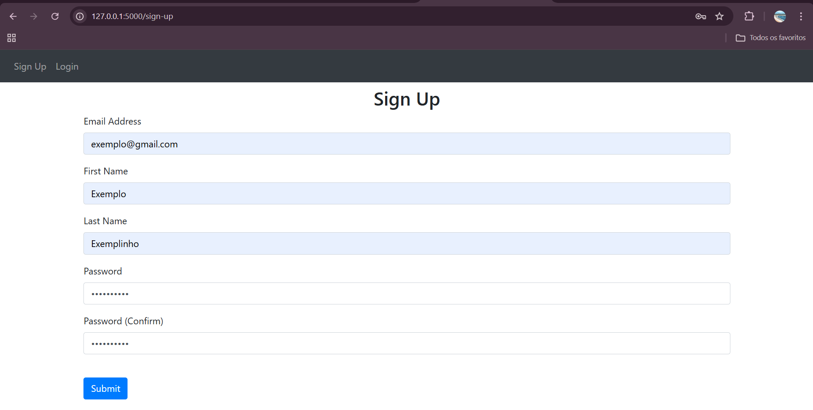

# 📝 Python Notes App

Um aplicativo web simples para criar notas em uma conta pessoal, desenvolvido com **Python** e **Flask**.
 Inspirado no vídeo do canal do Youtube Tech With Tim - https://www.youtube.com/watch?v=dam0GPOAvVI&t=535s 🖥️

## 🚀 Funcionalidades

- Cadastro e autenticação de usuários com criptografia
- Navegação web completa
- Adicionar novas notas e excluir à vontade!
- Notas com título e descrição -> **funcionalidade autoral**
- Armazenamento local com SQLite

## 🛠 Tecnologias utilizadas

- [Python 3.12](https://www.python.org/)
- [Flask](https://flask.palletsprojects.com/)
- [SQLite](https://www.sqlite.org/)
- [Jinja](https://jinja.palletsprojects.com/en/stable/)
- HTML5 e CSS3 (com Bootstrap)

## 🖼️ Imagens

 

